```mermaid
graph LR
  A["Developer source tree 📁"] .-> B(["Build a package"])
  B .-> C["package 📦"]
  C .-> D(["upload package"])
  D .-> U[("Centeral Store 🧀")]
```

```mermaid
graph LR
  U[("Centeral Store 🧀")] .-> A["package 📦"]
  A .-> B(["Discover & download package"])
  B .-> E{is wheel}
  E .->|yes| F(["Build wheel"])
  E .->|no| C(["Install wheel"])
  F .-> C
  C .-> D["Target machine 💻"]
```

<h2 highlight style="font-size: 3.3em !important; padding-bottom: 10px"> The new wave of Python Packaging </h2>

<h3 highlight> PyTexas <circle-flags-us-tx/> — April 11th 2025</h3>

### By Bernát Gábor / [<logos-bluesky class="animate-pulse"/> gjbernat.bsky.social](https://bsky.app/profile/gjbernat.bsky.social) / [<prime-twitter class="animate-pulse"/> gjbernat](https://x.com/gjbernat)/ [<fluent-mdl2-website class="animate-pulse"/> bernat.tech]()

<QRCode data="https://gaborbernat.github.io/new-wave-of-python-packaging" size=420 />

---
layout: intro
---

# Bernát Gábor

<div class="flex items-center">
  <div>
  <ul>
    <li>software engineer at Bloomberg (Data Technologies - Storage Platform)</li>
    <li v-click> OSS contributor <a target="_blank" href="https://github.com/gaborbernat">gaborbernat @ GitHub</a> - <a target="_blank" href="https://bernat.tech"> bernat.tech</a></li>
    <li v-click> member of the <span style="color: orange">Py</span>thon <span style="color: orange">P</span>ackaging <span style="color: orange">A</span>uthority (virtualen & build maintainer) </li>
    <li v-click> Husband to Lisa and parent to two Yorkshire Terriers: Silky & Junior </li>
    </ul>
  </div>
  <div>
    
  </div>
</div>

---
layout: full
---

<CopyrightImg img="sj_intro"/>

---
layout: full
---

<h1 style="font-size: 2em !important; padding-bottom: 10px"> Born+raised in Transylvania, living in Los Angeles
<circle-flags-hu/><circle-flags-ro/><circle-flags-gb-eng/><circle-flags-us/></h1>

<CopyrightImg img="transylvania" maxHeight="500px">
              This file is licensed under the
              <a target="_blank" href="https://en.wikipedia.org/wiki/en:Creative_Commons" class="extiw" title="w:en:Creative Commons">Creative Commons </a>
              <a rel="nofollow" class="external text" target="_blank" href="https://creativecommons.org/licenses/by-sa/4.0/deed.en">Attribution-Share Alike 4.0 International </a>
              license.
</CopyrightImg>

---

# Some of the packages I maintain

<Maintain />

---
layout: center
---

<h1>My goal today is to <span highlight>teach you to fish</span>, not to feed you</h1>

<v-clicks>

- Not quick how-to
- Not in-depth look into a given technology
- We'll learn concepts and standards that underpin Python packaging

</v-clicks>

---
layout: statement
---

<h1>No such thing as a stupid question, just a <span highlight>missed opportunity to learn</span></h1>

---
layout: section
---

<h1 highlight>Distributing Python code</h1>

---
layout: center
---

<h1 style="padding: 0; margin: 0"> Python code is easy to read (and write) 😁 </h1>
<h1 style="padding: 0; margin: 0" v-click> Shipping and running it to other machines is not 😭</h1>

<p v-click style="text-align: center; margin: 0"> people's faces when they gaze into Python packaging the first time</p>
<CopyrightImg v-after img="sad_pug" maxHeight="480px">
Photo by <a target="_blank" href="https://unsplash.com/@marcuslcramer?utm_source=ghost&amp;utm_medium=referral&amp;utm_campaign=api-credit">Marcus Cramer</a> / <a target="_blank" href="https://unsplash.com/?utm_source=ghost&amp;utm_medium=referral&amp;utm_campaign=api-credit">Unsplash</a>
</CopyrightImg>

---
layout: center
---

<h1>The bumpy learning curve - <span highlight>struggling is normal</span></h1>

<CopyrightImg img="learning_curve" maxHeight="541px">
<a target="_blank" href="https://sascha-kasper.com/the-bumpy-learning-curve/">Copyright 2024 Sascha Kasper All rights reserved</a>
</CopyrightImg>

---

# The state of Python packaging

<h2 v-click v-mark.red.circle>From <span style="color: orange">Py</span>thon
<span style="color: orange">P</span>ackaging <span style="color: orange">A</span>uthority point of view</h2>

<ul v-click>
We will focus on core Python only (think pypi.org and pip)<span v-click>:</span>
  <li v-after> <b style="color: red">not</b> conda</li>
  <li v-click> <b style="color: red">not</b> your OS packaging system (DPKG/RPM/etc.)</li>
</ul>

---

# Follow along via Binder (or Docker locally)

https://github.com/gaborbernat/new-wave-of-python-packaging-binder

<QRCode data="https://github.com/gaborbernat/new-wave-of-python-packaging-binder" size=450 />

---

<h1> Use case <span> - problem we'll use to explore the concepts</span></h1>

<div v-click>
Find the first <code>n</code> prime numbers.
</div>

<div v-click>
```python
def first_n(count: int) -> list[int]:
  ...
```
</div>
<ul v-click>
A natural (integer) number is prime if:
<li>greater than 1,</li>
<li>not a product of two smaller natural numbers.</li>
</ul>

<div v-click>
For example:

<ul>

<li>
First 5:
```python
assert first_n(5) == [2, 3, 5, 7, 11]
```
</li>

<li>
First 7:
```python
assert first_n(5) == [2, 3, 5, 7, 11, 13, 17]
```
</li>
</ul>
</div>

---

# Naive pure Python implementation

A natural (integer) number is prime if <span highlight>greater than 1</span>, and <span highlight>not a product of two
smaller natural numbers.</span>

```python {1-11|2|3,4,10|5-7|8-9|1-11|13-14|all}{lines:true,startLine:1}
import sys


def first_n(count: int) -> list[int]:
    primes: list[int] = []
    at = 2
    while len(primes) < count:
        for divisor in primes:
            if at % divisor == 0:
                break
        else:
            primes.append(at)
        at += 1
    return primes


def run() -> None:
    print(first_n(int(sys.argv[1])))

run(5000)
```

---

# Let's benchmark it with [hyperfine](https://github.com/sharkdp/hyperfine#hyperfine):

<div v-click>
```shell
❯ hyperfine --warmup 1 'python prime.py'
Benchmark 1: python prime.py
  Time (mean ± σ):     374.8 ms ±   8.4 ms    [User: 342.8 ms, System: 14.9 ms]
  Range (min … max):   356.6 ms … 381.8 ms    10 runs
```
</div>

---
layout: image
---

<h2>Back to packaging</h2>
<CopyrightImg img="junior" maxHeight="520px"/>

---

# How to make this code available on another machine?

<ol>
There are two ways to use the code:

<li v-click>
From within Python (the developer way)
<v-click at="3"><span highlight>⇒ library</span></v-click>
<v-click at="5"><span color-pink> - expose the logic to be used by an application</span></v-click>
```python
❯ python
Python 3.13.2 (main, Feb 12 2025, 14:59:08) [Clang 19.1.6 ] on darwin
Type "help", "copyright", "credits" or "license" for more information.
>>> from prime import primes
>>> primes(10)
[2, 3, 5, 7, 11, 13, 17, 19, 23, 29]
```
</li>

<li v-click>
From the command line (as an executable - to an end-user way)
<v-click at="4"><span highlight>⇒ application</span></v-click>
<v-click at="6"><span color-pink> - expose the functionality to an enduser</span></v-click>
```shell
❯ python prime.py
[2, 3, 5, 7, 11, 13, 17, 19, 23, 29]
```
</li>

</ol>

---

<h1>Applications</h1>

<ul>
Allow user to run but (likely) not see the code - <span highlight>closed system</span>.
The end user might interact with it as:
<li> a graphical user interface (GUI),</li>
<li> command-line interface (CLI),</li>
<li> or via web application.</li>
</ul>
<br/>

<ol>
<span v-click>Requires an artifact containing all of:</span>
  <li v-click>A <span highlight>Python interpreter</span> environment,</li>
  <li v-click><span highlight>Dependencies</span> - exact version (may be obfuscated),</li>
  <li v-click>The <span highlight>code</span> (may be obfuscated),</li>
  <li v-click><span highlight>Entry point</span> - describes how to invoke the application.</li>
</ol>

---

<h1>Library mode</h1>

<br/>
Allow user to interact with the code - <span highlight>open system</span>.

<ol>
<span v-click>Requires all of:</span>
  <li v-click>A <span highlight>Python interpreter</span> environment,</li>
  <li v-click><span highlight>Dependencies</span> - compatible versions (may be obfuscated),</li>
  <li v-click>The <span highlight>code</span> (may be obfuscated),</li>
</ol>

---

<h1>Acquiring the <span highlight>Python interpreter</span></h1>

<ol>
<li>
Official installer <a target="_blank" href="https://www.python.org/downloads/">python.org/downloads</a> (no Linux support)
<v-click at="3"><span highlight>⇒ requires admin rights</span></v-click>
</li>

<li v-click>
Provided by the operating system installer <v-click at="3"><span highlight>⇒ requires admin rights</span></v-click>
  <ul>
    <li>
    Linux - OS package manager:
    <ul>
      <li> Ubuntu - apt-get (<a target="_blank" href="https://launchpad.net/~deadsnakes/+archive/ubuntu/ppa">deadsnakes</a>), </li>
      <li> Fedora - yum</li>
      <li> Arch Linux - pacman</li>
      <li> et cetera.</li>
    </ul>
    </li>
    <li>
      macOS - part of the
      <a target="_blank" href="https://developer.apple.com/library/archive/documentation/MacOSX/Conceptual/OSX_Technology_Overview/SystemFrameworks/SystemFrameworks.html">OS X Frameworks</a>
      or <a target="_blank" href="https://docs.brew.sh/Homebrew-and-Python">Homebrew</a>
    </li>
    <li>
    Windows - <a target="_blank" href="https://apps.microsoft.com/search?query=python&hl=en-us&gl=US">App Store</a>
    </li>
  </ul>
</li>

<li v-click>
Built from source: <a target="_blank" href="https://github.com/pyenv/pyenv">pyenv</a> (pyenv-win for Windows)
<v-click at="3"><span highlight>⇒ requires CPython build stack (libraries + compiler) installed</span></v-click>
</li>
</ol>

---

<h1> Installing Python <span highlight>is</span> complicated</h1>

<CopyrightImg img="xkcd_interpreters" maxHeight="500px">
<a target="_blank" href="https://xkcd.com/1987/">Copyright xkcd All rights reserved</a>
</CopyrightImg>

---

<h1>Installing Python <span highlight>was </span> complicated ⇒ <a target="_blank" href="https://github.com/astral-sh/python-build-standalone" highlight>Standalone builds</a></h1>

<ul>
<li>Python Standalone Builds: Standalone, highly-redistributable builds of Python.</li>
<v-click at="1">
  <li> Maintained and distributed by <a target="_blank" href="https://astral.sh/">Astral</a>.
    <ul>
    <v-click at="2"><li>Venture capital funded company, but all current projects are open source and freely distributed.</li></v-click>
    <v-click at="3"><li>All tools are written and optimized in Rust (blazing fast - <uim-rocket class="text-orange-400 animate-pulse" /><uim-rocket class="text-orange-400 animate-pulse" /><uim-rocket class="text-orange-400 animate-pulse" />).</li></v-click>
    <v-click at="4"><li>Authors of <a target="_blank" href="https://docs.astral.sh/ruff/">ruff</a> (formatter and linter - replaces black / flake8 / pylint / etc.).</li></v-click>
    </ul>
  </li>
</v-click>
<v-click at="5">
  <li>So how do I use it? <v-click at="6">- through <a target="_blank" href="https://docs.astral.sh/uv">uv</a> - install through terminal

```shell
~/w ❯ curl -LsSf https://astral.sh/uv/install.sh | sh
# Windows: powershell -ExecutionPolicy ByPass -c "irm https://astral.sh/uv/install.ps1 | iex"
downloading uv 0.6.10 x86_64-unknown-linux-gnu
no checksums to verify
installing to ~/.local/bin
  uv
  uvx
everything's installed!

~/w ❯ uv version
uv 0.6.10
```

  </v-click>
  </li>
</v-click>
</ul>

---

# Keeping uv up to date

```shell
~/w ❯ uv self update

info: Checking for updates...
success: You're on the latest version of uv (v0.6.10)
```

---

<h1><span highlight>Install </span> Python <span highlight>was </span> complicated ⇒ <a target="_blank" href="https://github.com/astral-sh/python-build-standalone" highlight>Standalone builds</a></h1>

<v-click>
```shell
~/w ❯ uv python install 3.12
Installed Python 3.12.9 in 18.27s
 + cpython-3.12.9-linux-aarch64-gnu
```
</v-click>

<v-click>
```shell
~/w ❯ uv python install 3.8
Installed Python 3.8.20 in 20.61s
 + cpython-3.8.20-linux-aarch64-gnu
```
</v-click>

<v-click>
```shell
~/w ❯ which -a python
/usr/bin/python
/bin/python
```
</v-click>

---

<h1><span highlight>List</span> Python interpreters ⇒ <a target="_blank" href="https://github.com/astral-sh/python-build-standalone" highlight>Standalone builds</a></h1>

<v-click>
```shell
~/w ❯ uv python list
...
cpython-3.13.2-linux-aarch64-gnu                   /usr/bin/python3.13
...
cpython-3.13.2-linux-aarch64-gnu                   ~/.local/share/uv/python/cpython-3.13.2-linux-aarch64-gnu/bin/python3.13
cpython-3.12.9-linux-aarch64-gnu                   ~/.local/share/uv/python/cpython-3.12.9-linux-aarch64-gnu/bin/python3.12
cpython-3.11.11-linux-aarch64-gnu                  <download available>
...
cpython-3.9.21-linux-aarch64-gnu                  ~/.local/share/uv/python/cpython-3.9.21-linux-aarch64-gnu/bin/python3.9
```
</v-click>

<v-click>
```shell
~/w ❯ ~/.local/share/uv/python/cpython-3.13.2-linux-aarch64-gnu/bin/python3.13  -c 'import sys; print(sys.version)'
3.13.2 (main, Mar 17 2025, 21:02:54) [Clang 20.1.0 ]
~/w ❯ ~/.local/share/uv/python/cpython-3.8.20-linux-aarch64-gnu/bin/python3.8 -c 'import sys; print(sys.version)'
3.9.21 (main, Mar 17 2025, 20:47:55)
[GCC 6.3.0 20170516]
```
</v-click>

---

# Virtual environments

Python Interpreter is made up of:

- The interpreter itself (`python` executable)<v-click at="1"><span highlight> ⇒ constant</span></v-click>
- Standard library (batteries included) <v-click at="1"><span highlight> ⇒ constant</span></v-click>
- Third-party libraries (none out of box)<v-click at="1"><span highlight> ⇒ changes by project</span></v-click>

<v-click at="2">
The way to share the constant between your projects without needing to install a new Python is virtual environments.
</v-click>

---

# Virtual environment implementations

<v-clicks>
<ol>
<li><a target="_blank" href="https://docs.python.org/3/library/venv.html">Standard library</a>
<v-click at="4"><span highlight> ⇒ built into the interpreter</span></v-click>
```shell
❯ python -m venv name-1
```
</li>
<li><a target="_blank" href="https://virtualenv.pypa.io/en/latest/">virtualenv</a>
<v-click at="4"><span highlight> ⇒ 3rd party tool written in Python</span></v-click>
```shell
❯ virtualenv name-2
created virtual environment CPython3.13.2.final.0-64 in 826ms
  creator CPython3Posix(dest=~/name-2, clear=False, no_vcs_ignore=False, global=False)
  seeder FromAppData(download=False, pip=bundle, via=copy, app_data_dir=~/.local/share/virtualenv)
    added seed packages: pip==25.0.1
  activators BashActivator,CShellActivator,FishActivator,NushellActivator,PowerShellActivator,PythonActivator
```
</li>
<li>
<a target="_blank" href="https://docs.astral.sh/uv/pip/environments/#creating-a-virtual-environment">uv venv</a>
<v-click at="4"><span highlight> ⇒ 3rd party tool written in Rust and exposed under uv</span></v-click>
```shell
❯ uv venv name-3
Using CPython 3.13.2
Creating virtual environment at: uv-name
Activate with: source uv-name/bin/activate
```
</li>
</ol>
</v-clicks>

---

# What is a virtual environment

A collection of files that provides <span highlight>isolation</span> from the global Python.

```shell
~/w ❯ lsd --tree --depth 4 name-3
📂 name-3
├── 📂 bin
│   ├── 📄 activate
│   ├── 📄 activate.bat
│   ├── 📄 activate.csh
│   ├── 📄 activate.fish
...
│   ├── 📄 activate_this.py
│   ├── 📄 deactivate.bat
│   ├── 📄 pydoc.bat
│   ├── 🔖 python ⇒ ~/.local/share/uv/python/cpython-3.13.2-linux-aarch64-gnu/bin/python3.13
│   ├── 🔖 python3 ⇒ python
│   └── 🔖 python3.13 ⇒ python
├── 📄 CACHEDIR.TAG
├── 📂 lib
│   └── 📂 python3.13
│       └── 📂 site-packages
│           ├── 📄 _virtualenv.pth
│           └── 📄 _virtualenv.py
├── 🗂 lib64 ⇒ lib
└── 📄 pyvenv.cfg
```

---

# What is virtualenv?

<ul>
<li v-click> A tool: Python application that exposes a CLI to create virtual environments. </li>
<li v-click>Not built into the standard library, but rather an external 3rd party library. </li>
<li v-click>Requires installation before you can use it, via an installer such as `pip`. </li>
</ul>

---

<h1><span highlight> Installer</span> - installs 3rd party packages into Python</h1>

<ul>
<li v-click>Can be either a system Python or a virtual environment Python</li>
<li v-click>However, you should almost never install anything into the global one</li>
<li v-click>Most widely used one today is <span highlight>pip</span> - 3rd party tool, but provisioned for venv/virtualenv:

```shell
~/w ❯ lsd --tree --depth 4 name-1/bin/
📂 bin
├── 📄 activate
├── 📄 activate.csh
├── 📄 activate.fish
├── 📄 Activate.ps1
├── 🏗 pip
├── 🏗 pip3
├── 🏗 pip3.13
├── 🔖 python ⇒ /usr/bin/python
├── 🔖 python3 ⇒ python
└── 🔖 python3.13 ⇒ python

~/w ❯ name-1/bin/pip --version
pip 24.2 from ~/w/name-1/lib64/python3.13/site-packages/pip (python 3.13)
```

</li>
</ul>

---

# Installing with uv - uv pip

<v-click>
```shell
~/w ❯ uv venv
Using CPython 3.13.2
Creating virtual environment at: .venv
Activate with: source .venv/bin/activate.fish
```
</v-click>

<v-click>
```shell
~/w ❯ uv pip install virtualenv
Resolved 4 packages in 1.31s
Prepared 4 packages in 6.99s
Installed 4 packages in 19ms
 + distlib==0.3.9
 + filelock==3.18.0
 + platformdirs==4.3.7
 + virtualenv==20.29.3
```
</v-click>

---

<h1> Installing with uv - uv pip</h1>

```shell
~/w took 5s16ms ❯ hyperfine --warmup 1 \
  'name-1/bin/pip uninstall virtualenv; name-1/bin/pip install virtualenv' \
  'uv pip uninstall virtualenv; uv pip install virtualenv'

Benchmark 1: name-1/bin/pip uninstall virtualenv; name-1/bin/pip install virtualenv
  Time (mean ± σ):     389.4 ms ±  15.2 ms    [User: 349.0 ms, System: 40.2 ms]
  Range (min … max):   370.4 ms … 411.9 ms    10 runs

Benchmark 2: uv pip uninstall virtualenv; uv pip install virtualenv
  Time (mean ± σ):      17.1 ms ±   2.2 ms    [User: 6.9 ms, System: 11.6 ms]
  Range (min … max):    14.8 ms …  28.8 ms    127 runs

Summary
  uv pip uninstall virtualenv; uv pip install virtualenv ran
   22.74 ± 3.08 times faster than name-1/bin/pip uninstall virtualenv; name-1/bin/pip install virtualenv
```

---

# Why each tool should have it's own virtual environment

```shell {all|1,7|all}{lines:true,startLine:1}
~/w ❯ uv pip install virtualenv==20.28
Resolved 4 packages in 9ms
Installed 4 packages in 25ms
 + distlib==0.3.9
 + filelock==3.18.0
 + platformdirs==4.3.7
 + virtualenv==20.28.0
```

<v-click>
```shell {all|12-13|all}{lines:true,startLine:1}
~/w ❯ uv pip install tox
Resolved 11 packages in 39ms
Uninstalled 1 package in 2ms
Installed 8 packages in 20ms
 + cachetools==5.5.2
 + chardet==5.2.0
 + colorama==0.4.6
 + packaging==24.2
 + pluggy==1.5.0
 + pyproject-api==1.9.0
 + tox==4.24.2
 - virtualenv==20.28.0
 + virtualenv==20.29.3
```
</v-click>

---

# Why each tool should have it's own virtual environment

```shell
~/w ❯ uv pip install tox==4.24.2 virtualenv==20.28
  × No solution found when resolving dependencies:
  ╰─▶ Because tox==4.24.2 depends on virtualenv>=20.29.1 and you require tox==4.24.2,
      we can conclude that you require virtualenv>=20.29.1.
      And because you require virtualenv==20.28, we can conclude that your requirements are unsatisfiable.
```

---

<h1> Managing tools -  <span highlight>installations</span></h1>

```shell
~/w ❯ uv tool install virtualenv
Resolved 4 packages in 828ms
Installed 4 packages in 21ms
 + distlib==0.3.9
 + filelock==3.18.0
 + platformdirs==4.3.7
 + virtualenv==20.29.3
Installed 1 executable: virtualenv

~/w took 876ms ❯ virtualenv --version
virtualenv 20.29.3 from ~/.local/share/uv/tools/virtualenv/lib/python3.13/site-packages/virtualenv/__init__.py
```

---

<h1> Managing tools -  <span highlight>enumerate</span></h1>

```shell
~/w ❯ uv tool list
jupyter-core v5.7.2
- jupyter
- jupyter-migrate
- jupyter-troubleshoot
pipx v1.7.1
- pipx
virtualenv v20.29.3
- virtualenv
```

---

<h1> Managing tools -  <span highlight>uninstall</span></h1>

```shell
~/w ❯ which -a virtualenv
~/.local/bin/virtualenv

~/w ❯ uv tool uninstall virtualenv
Uninstalled 1 executable: virtualenv

~/w ❯ which -a virtualenv
which: no virtualenv in (~/.local/bin:/usr/local/sbin:/usr/local/bin:/usr/sbin:/usr/bin:/sbin:/bin)
```

---

<h1> Managing tools -  <span highlight>upgrade</span></h1>

```shell
~/w ❯ uv tool upgrade --all
```

---

<h1> Managing tools -  <span highlight>via <a target="_blank" href="https://github.com/pypa/pipx">pipx</a></span></h1>

```shell
~/w ❯ pipx install cowsay
  installed package cowsay 6.1, installed using Python 3.13.2
  These apps are now globally available
    - cowsay
done! ✨ 🌟 ✨

~/w ❯ pipx list
venvs are in ~/.local/share/pipx/venvs
apps are exposed on your $PATH at ~/.local/bin
manual pages are exposed at ~/.local/share/man
   package cowsay 6.1, installed using Python 3.13.2
    - cowsay
```

---

# pipx vs. uv

```shell
~/w ❯ hyperfine --warmup 1
      'uv tool uninstall virtualenv; uv tool install virtualenv' \
      'pipx uninstall virtualenv --force; pipx install virtualenv'

Benchmark 1: uv tool uninstall virtualenv; uv tool install virtualenv
  Time (mean ± σ):      22.2 ms ±   4.0 ms    [User: 9.6 ms, System: 16.8 ms]
  Range (min … max):    18.6 ms …  39.2 ms    115 runs

Benchmark 2: pipx uninstall virtualenv --force; pipx install virtualenv
  Time (mean ± σ):     193.3 ms ±   5.3 ms    [User: 174.0 ms, System: 19.3 ms]
  Range (min … max):   181.9 ms … 203.8 ms    15 runs

Summary
  uv tool uninstall virtualenv; uv tool install virtualenv ran
    8.71 ± 1.60 times faster than pipx uninstall virtualenv --force; pipx install virtualenv
```

<v-click>

But pipx has more features today, e.g.,:

- expose additional entry-points,
- install the same package multiple times.

</v-click>

---

<h1> <a target="_blank" href="https://virtualenv.pypa.io/en/latest/user_guide.html#programmatic-api">virtualenv</a></h1>

```shell
~/w ❯ virtualenv venv
created virtual environment CPython3.13.2.final.0-64 in 195ms
  creator CPython3Posix(dest=~/w/venv, clear=False, no_vcs_ignore=False, global=False)
  seeder FromAppData(download=False, pip=bundle, via=copy, app_data_dir=~/.local/share/virtualenv)
    added seed packages: pip==25.0.1
  activators BashActivator,CShellActivator,FishActivator,NushellActivator,PowerShellActivator,PythonActivator
```

Compared to `uv venv` has programatic API and is faster than `python -m venv`.

---

# Speed comparision of virtual environment creation

```shell
❯ hyperfine --warmup 1 'python -m venv venv --clear' 'virtualenv venv --clear' 'uv venv' -N
Benchmark 1: python -m venv venv --clear
  Time (mean ± σ):      1.259 s ±  0.056 s    [User: 1.176 s, System: 0.082 s]
  Range (min … max):    1.189 s …  1.336 s    10 runs

Benchmark 2: virtualenv venv --clear
  Time (mean ± σ):     142.2 ms ±   7.3 ms    [User: 108.7 ms, System: 32.4 ms]
  Range (min … max):   129.0 ms … 167.6 ms    21 runs

Benchmark 3: uv venv
  Time (mean ± σ):       5.5 ms ±   0.9 ms    [User: 1.8 ms, System: 3.1 ms]
  Range (min … max):     4.7 ms …  15.7 ms    489 runs

Summary
  uv venv ran
   25.75 ± 4.24 times faster than virtualenv venv --clear
  228.12 ± 37.06 times faster than python -m venv venv --clear
```

---

# So what to use?

<ul>
<li>Use <span highlight>uv venv</span> when possible, </li>
<li>use <span highlight>virtualenv</span> if you want to inspect created virtual environments (mostly if you are writing a tool), </li>
<li>and <span highlight>venv</span> otherwise.</li>
</ul>
<CopyrightImg img="looking_silky_junior" maxHeight="405px"/>

---

# The import system

<CopyrightImg img="junior_silky_look_beach" maxHeight="500px"/>

---

# The <a target="_blank" href="https://docs.python.org/3/reference/import.html" highlight>import system</a>

<span v-click>
<h2>How does Python know if something is import-able?</h2>

```python
>>> import functools
>>> functools
<module 'functools' from '~/.local/share/uv/python/cpython-3.13.2-linux-x86_64-gnu/lib/python3.13/functools.py'>
```

</span>

<span v-click class="text-red font-bold">It doesn't.</span>

<span v-click>
```python
>>> import functoolx
Traceback (most recent call last):
  File "<python-input-0>", line 1, in <module>
    import functoolx
ModuleNotFoundError: No module named 'functoolx'
```
</span>

<span v-click> Instead it <span highlight>always</span> tries to import and raises if it fails. </span> <br/>
<span v-click class="text-3xl text-blue">It's easier to ask for forgiveness than permission.</span>

---

# from imports

<h2 class="text-blue"> Is a syntactic sugar for a module import and then an assigment </h2>

```python{all|1|2-3|5-6|8-9|11-12|14-16|18-20|9,12,16,20|all}
>>> import functools
>>> functools
<module 'functools' from '/usr/lib64/python3.13/functools.py'>

>>> dir(functools)[-3:]
['total_ordering', 'update_wrapper', 'wraps']

>>> functools.__dict__['wraps']
<function wraps at 0x1043aba60>

>>> functools.wraps
<function wraps at 0x1043aba60>

>>> wraps = functools.wraps
>>> wraps
<function wraps at 0x1043aba60>

>>> from functools import wraps
>>> wraps
<function wraps at 0x1043aba60>
```

---

# Not all modules are equal

````md magic-move
```python{1-2|3-5|7-9|11-13|15-17|18-21|23-25}
Python 3.13.2 (main, Feb  4 2025, 00:00:00) [GCC 14.2.1 20250110 (Red Hat 14.2.1-7)] on linux
Type "help", "copyright", "credits" or "license" for more information.
>>> import sys
>>> sys
<module 'sys' (built-in)>

>>> import os
>>> os
<module 'os' (frozen)>

>>> import functools
>>> functools
<module 'functools' from '/usr/lib64/python3.13/functools.py'>

>>> import _csv
>>> _csv
<module '_csv' from '/usr/lib64/python3.13/lib-dynload/_csv.cpython-313-aarch64-linux-gnu.so'>

>>> import packaging
>>> packaging
<module 'packaging' from '/usr/local/lib/python3.13/site-packages/packaging/__init__.py'>

>>> import tomli_w
>>> tomli_w
<module 'tomli_w' from '/root/.local/lib/python3.13/site-packages/tomli_w/__init__.py'>
```

```python
Python 3.13.2 (main, Feb  4 2025, 00:00:00) [GCC 14.2.1 20250110 (Red Hat 14.2.1-7)] on linux
Type "help", "copyright", "credits" or "license" for more information.
>>> import sys
>>> sys # standard library module: built-in
<module 'sys' (built-in)>

>>> import os
>>> os # standard library module: frozen
<module 'os' (frozen)>

>>> import functools
>>> functools # standard library module: Python file
<module 'functools' from '/usr/lib64/python3.13/functools.py'>

>>> import _csv
>>> _csv # standard library module: binary file
<module '_csv' from '/usr/lib64/python3.13/lib-dynload/_csv.cpython-313-aarch64-linux-gnu.so'>

>>> import packaging
>>> packaging # 3rd party global library => python -m pip
<module 'packaging' from '/usr/local/lib/python3.13/site-packages/packaging/__init__.py'> #

>>> import tomli_w
>>> tomli_w # 3rd party user library => python -m pip --user
<module 'tomli_w' from '/root/.local/lib/python3.13/site-packages/tomli_w/__init__.py'>
```
````

---

# The import system

```python
>>> from pprint import pprint
>>> import sys
>>> pprint(sys.meta_path)
[<class '_frozen_importlib.BuiltinImporter'>,
 <class '_frozen_importlib.FrozenImporter'>,
 <class '_frozen_importlib_external.PathFinder'>]
```

---

# Built-in modules - [BuiltinImporter](https://docs.python.org/3/library/importlib.html#importlib.machinery.BuiltinImporter)

```python
>>> sys.builtin_module_names
('_abc', '_ast', '_codecs', '_collections', '_datetime', '_functools', '_imp', '_io', '_locale', '_operator', '_signal',
 '_sre', '_stat', '_string', '_suggestions', '_symtable', '_sysconfig', '_thread', '_tokenize', '_tracemalloc', '_typing',
 '_warnings', '_weakref', 'atexit', 'builtins', 'errno', 'faulthandler', 'gc', 'itertools', 'marshal', 'posix', 'pwd',
 'sys', 'time')
```

---

# Frozen modules - [FrozenImporter](https://docs.python.org/3/library/importlib.html#importlib.machinery.FrozenImporter)

Frozen modules are modules written in Python whose compiled byte-code object is incorporated into a custom-built Python
interpreter by Python’s freeze utility.

So even if you change the content of the file onto the file system, those changes will not be picked up.

---

# Path finder - [PathFinder](https://docs.python.org/3/library/importlib.html#importlib.machinery.PathFinder)

Discover modules available on the file system path.

<v-click>

````md magic-move
```python
>>> pprint(sys.path)
['',
 '/usr/lib64/python313.zip',
 '/usr/lib64/python3.13',
 '/usr/lib64/python3.13/lib-dynload',
 '/usr/local/lib/python3.13/site-packages',
 '/usr/lib64/python3.13/site-packages',
 '/usr/lib/python3.13/site-packages']
```

```python
>>> pprint(sys.path)
['',
 '/usr/lib64/python313.zip', # standard library compressed
 '/usr/lib64/python3.13', # standard library
 '/usr/lib64/python3.13/lib-dynload', # standard library c-extensions
 '/usr/local/lib/python3.13/site-packages', # packages installed to the user
 '/usr/lib64/python3.13/site-packages',  # package installed globally - platform dependent (purelib)
 '/usr/lib/python3.13/site-packages']  # package installed globally - pure python (platlib)
```
````

</v-click>

---

# Virtual environment - revisited

A virtual environment is an isolated Python environment that has:

- access to its own site package
- shares access to host: built-ins and standard library
- optionally isolated from the global site package (always from user)

---

<CopyrightImg img="junior_sleep" />

---
layout: image
---

# How to package a library?

<CopyrightImg img="tennis" maxHeight="500px"/>

---

# What is a library?

<ul>
Code that can be:
<li><span highlight>imported</span> and executed</li>
<li>from within a <span highlight>Python interpreter</span></li>
</ul>

---

# Shipping code to another machine

```mermaid
flowchart LR
  A["Developer source tree 📁"] --- B>"package 📦"]
  B .-> C["Target machine 💻"]
```



<br/>

<span v-click :scale="1">

</span>

---

<CopyrightImg img="silky" />

---

<h1> Package types - <span highlight>sdist</span></h1>

Source distribution - resembles what we have on the developer machine

<ul>
  <li highlight>all the files needed to install (and test) a package from raw source</li>
  <li v-click>
    source tree minus
    <ul>
      <li>project management files</li>
      <li>maintainer files</li>
    </ul>
  </li>
  <li v-click>has business logic, packaging, tests</li>
</ul>

```shell {all|1,3-5,11-12}
❯ lsd --tree . -a --ignore-glob .venv --ignore-glob .pytest_cache
📂 .
├── 📂 .github
│   └── 📄 SECURITY.md
├── 📄 .gitignore
├── 📂 primes
│   ├── 📄 __init__.py
│   └── 📄 py.typed
├── 📄 pyproject.toml
└── 📂 tests
    ├── 📂 __pycache__
    │   └── 📄 test_prime.cpython-313-pytest-8.3.5.pyc
    └── 📄 test_prime.py
```

---

<h1> Package types - <span highlight>wheel</span></h1>

Resembles what we want on the target machine

<ul>
  <li highlight>The installed binary files with some metadata</li>
  <li v-click>
    source tree minus
    <ul>
      <li>project management files</li>
      <li>maintainer files</li>
      <li>tests files</li>
      <li>packaging files</li>
    </ul>
  </li>
</ul>

```shell
❯ lsd --tree .venv/bin/primes .venv/lib/python3.13/site-packages/primes* --icon-theme unicode -a
🏗 primes
📂 primes
├── 📄 __init__.py
├── 📂 __pycache__
│   └── 📄 __init__.cpython-313.pyc
└── 📄 py.typed
📂 primes-1.0.0.dist-info
├── 📄 direct_url.json
├── 📄 entry_points.txt
├── 📄 INSTALLER
...
└── 📄 WHEEL
```

---
layout: statement
---

# Build an sdist or a wheel?

We always install wheel - if we have a sdist, we first build a wheel from it.

---

# Breaking down shipping a library

```mermaid
graph LR
  A["Developer source tree 📁"] .- B>"package 📦"]
  B .-> U[("Central Store 🧀")]
  U .-> D>"package 📦"]
  D .-> C["Target machine 💻"]
```



<v-click>
<h2 text-center highlight>1. Generate a package</h2>



</v-click>

<v-click>
<h2 text-center highlight>2. Consume a package</h2>



</v-click>

---
layout: section
---

<h1 highlight> Build a package</h1>

<CopyrightImg img="junior_sand" maxHeight="460px"/>

---

# Building a package

<ul>

<li>
Back in the old days (but <span highlight>don't</span> do this anymore):

```shell
setup.py build_sdist
```

</li>

<li v-click>
Instead, since 2020, use the <a target="_blank" href="https://pypi.org/project/build/"> build </a> tool:

<Transform :scale="0.96">
```shell
~/w/1 ❯ uv tool install build
Resolved 3 packages in 1.09s
Prepared 3 packages in 447ms
Installed 3 packages in 16ms
+ build==1.2.2.post1
+ packaging==24.2
+ pyproject-hooks==1.2.0
```

```shell
~/w/1 ❯ pyproject-build
* Creating isolated environment: venv+pip...
* Installing packages in isolated environment:
  - hatch-vcs>=0.4
* Getting build dependencies for sdist...
* Building sdist...
* Building wheel from sdist
* Creating isolated environment: venv+pip...
* Installing packages in isolated environment:
  - hatch-vcs>=0.4
* Getting build dependencies for wheel...
* Building wheel...
Successfully built primes-1.0.0.tar.gz and primes-1.0.0-py3-none-any.whl
```

</Transform>
  </li>
</ul>

---

# Or better yet just use uv

```shell
~/w/1 ❯ uv build
Building source distribution...
Building wheel from source distribution...
Successfully built dist/primes-1.0.0.tar.gz
Successfully built dist/primes-1.0.0-py3-none-any.whl
```

---

# How does build work?

The participating elements at high level are:

- user with the source code
- frontend: prepares an isolated environment, and invokes the backend
  - [build](https://pypi.org/project/build/)
  - [uv](https://docs.astral.sh/uv/)
  - [pip](https://pip.pypa.io/en/stable/)
  - [tox](https://tox.wiki)
- backend: performs the package generation in an isolated environment
  - [setuptools](https://setuptools.pypa.io/en/latest/)
  - [hatchling](https://hatch.pypa.io/latest/config/build/)
  - [flit](https://flit.pypa.io/en/stable/)
  - [pdm](https://github.com/pdm-project/pdm)
  - [poetry](https://python-poetry.org/)
  - uv

---

# Challenges of many backends

With each backend having its own configuration file made it difficult to teach how to do something, or for tools to
discover metadata about the project.

In 2016, the `build-system` table is defined via <a target="_blank" href="https://peps.python.org/pep-0517/">
PEP-517</a> and <a target="_blank" href="https://peps.python.org/pep-0518/"> PEP-518</a>.

In 2020, a new standard was added via [PEP-621](https://peps.python.org/pep-0621/) -
[Declaring project metadata: the pyproject.toml project table](https://packaging.python.org/en/latest/specifications/pyproject-toml/#pyproject-toml-spec).

```toml {all|1-3|5-}{lines:true,startLine:1}
[build-system]
build-backend = "hatchling.build"
requires = [ "hatch-vcs>=0.4" ]

[project]
name = "primes"
version = "1.0.0"
description = "Generate primes"
authors = [
  { name = "Bernat Gabor", email = "gaborjbernat@gmail.com" },
]
requires-python = ">=3.12"
classifiers = [
  "Programming Language :: Python :: 3 :: Only",
  "Programming Language :: Python :: 3.12",
  "Programming Language :: Python :: 3.13",
]
scripts.primes = "primes:first_n"
```

---

# Breakdown of a build command

<Transform :scale="0.85">


</Transform>

---

# Inspecting a source distribution

```shell
~/w/1 via ❯ tar -tvf dist/primes-1.0.0.tar.gz
-rw-r--r-- 0/0              26 2020-02-02 00:00 primes-1.0.0/.github/SECURITY.md
-rw-r--r-- 0/0             331 2020-02-02 00:00 primes-1.0.0/primes/__init__.py
-rw-r--r-- 0/0               0 2020-02-02 00:00 primes-1.0.0/primes/py.typed
-rw-r--r-- 0/0              99 2020-02-02 00:00 primes-1.0.0/tests/test_prime.py
-rw-r--r-- 0/0              12 2020-02-02 00:00 primes-1.0.0/.gitignore
-rw-r--r-- 0/0             641 2020-02-02 00:00 primes-1.0.0/pyproject.toml
-rw-r--r-- 0/0             460 2020-02-02 00:00 primes-1.0.0/PKG-INFO
```

<v-click>
<span highlight>Excercise</span>: remove .github folder from the built artifact (note we're using <a target="_blank" href="https://hatch.pypa.io/latest/config/build/#file-selection">hatchling</a> as our  build backend).
</v-click>

---

# Inspecting a wheel

```shell
~/w/1 ❯ unzip -l dist/primes-1.0.0-py3-none-any.whl
Archive:  dist/primes-1.0.0-py3-none-any.whl
  Length      Date    Time    Name
---------  ---------- -----   ----
      331  02-02-2020 00:00   primes/__init__.py
        0  02-02-2020 00:00   primes/py.typed
      460  02-02-2020 00:00   primes-1.0.0.dist-info/METADATA
       87  02-02-2020 00:00   primes-1.0.0.dist-info/WHEEL
       42  02-02-2020 00:00   primes-1.0.0.dist-info/entry_points.txt
      439  02-02-2020 00:00   primes-1.0.0.dist-info/RECORD
---------                     -------
     1359                     6 files
```

Installing a wheel now is:

- extracting the content of this zip file to the Python environments respective site package folder,
- create some metadata files,
- optionally generating entry points.

---

# Console scripts

They are just an executable file that imports the specified module and calls a method within it:

```shell
~/w/1 ❯ cat .venv/lib/python3.13/site-packages/primes-1.0.0.dist-info/entry_points.txt
[console_scripts]
primes = primes:first_n
```

```python
~/w/1 via 🐍 v3.13.2 ❯ cat .venv/bin/primes
#!~/w/1/.venv/bin/python3
# -*- coding: utf-8 -*-
import sys
from primes import first_n
if __name__ == "__main__":
    if sys.argv[0].endswith("-script.pyw"):
        sys.argv[0] = sys.argv[0][:-11]
    elif sys.argv[0].endswith(".exe"):
        sys.argv[0] = sys.argv[0][:-4]
    sys.exit(first_n())
```

---

# How to build a package

- Pick your build backend
- Use pyproject.toml to specify:
  - build dependencies
  - build backend interface
  - files to include
  - dependencies

---
layout: full
---

<CopyrightImg img="silky_junior_stand"/>

---

<h1> <span highlight>Excercise</span> - speed up via <a target="_blank" href="https://cython.readthedocs.io/en/latest/src/userguide/source_files_and_compilation.html#basic-setup-py">Cython</a></h1>

```python
# _primes.pyx

def primes(int nb_primes):
    cdef int n, i, len_p
    cdef int[10000] p
    if nb_primes > 10000:
        raise ValueError(nb_primes)
    len_p = 0
    n = 2
    while len_p < nb_primes:
        for i in p[:len_p]:
            if n % i == 0:
                break
        else:
            p[len_p] = n
            len_p += 1
        n += 1
    result_as_list = [prime for prime in p[:len_p]]
    return result_as_list
```

---

# Binary packages

Allow us to run faster, but their build is more complicated. Wheels are a way to remove this pain for end-users.

```shell
❯ hyperfine --warmup 1 '.venv/bin/primes 5000' '.venv/bin/primes-fast 5000'
Benchmark 1: .venv/bin/primes 5000
  Time (mean ± σ):     417.5 ms ±   8.5 ms    [User: 390.8 ms, System: 8.4 ms]
  Range (min … max):   408.3 ms … 433.0 ms    10 runs

Benchmark 2: .venv/bin/primes-fast 5000
  Time (mean ± σ):      55.6 ms ±  18.3 ms    [User: 28.0 ms, System: 7.1 ms]
  Range (min … max):    40.4 ms … 168.8 ms    46 runs

Summary
  .venv/bin/primes-fast 5000 ran
    7.51 ± 2.47 times faster than .venv/bin/primes 5000
```

---

<h1 highlight>Dependencies</h1>

Dependencies are what our library will always need, e.g., if we're making a network request <a >httpx</a>

```python
import httpx

def do() -> None:
    print(len(httpx.get("https://pypi.org/simple/packaging/").content))

do()
```

would need:

```toml
[project]
dependencies = [ "httpx>=0.28.1" ]
```

---

<h1 highlight>Extras</h1>

Extras are dependencies that we sometime might need

```python
def do() -> None:
  try:
    import httpx
  except ImportError:
    print(len(httpx.get("https://pypi.org/simple/packaging/").content))
  else:
    print(0)

do()
```

would need:

```toml
[project]
optional-dependencies.network.dependencies = [ "httpx>=0.28.1" ]
```

And install via:

```shell
uv pip install --extra network .
# uv pip install package[network]
```

---

<h1> <span highlight>Dependency groups </span> since 2024 - <a target="_blank" href="https://peps.python.org/pep-0735/">PEP- 735</a> </h1>

These are sets of dependencies that are meant for developers of the library, not our end-users, such as:

- development dependencies,
- type checker,
- development tasks.

For example:

```toml
[dependency-groups]
dev = [ { include-group = "test" }, { include-group = "type" } ]
test = [ "pytest>=8.3.5" ]
type = [ "pyright>=1.1.397" ]
```

And install via:

```shell
uv pip install --group test --group type
uv pip install --group dev
```

---

# How does install work

- If not local file, use the PyPI index (https://pypi.org/simple) to see if package exists using name:
  ```shell
  packaging-21.0-py3-none-any.whl
  numpy-2.2.4-cp313-cp313t-macosx_14_0_x86_64.whl
  ```
  - Prefer wheels over source distributions
  - If found a match download
- If a source distribution build a wheel (in a temporary folder)
- Install wheel

A low-level implementation focusing on just this is [installer](https://github.com/pypa/installer).

---

# How to upload built packages

We'll use a simple local [PyPI server](https://pypi.org/project/pypiserver/) to test this.

```shell
❯ pypi-server run -p 8080 -vvvv -P . -a . -o
```

Then in another shell:

```shell
❯ curl http://127.0.0.1:8080/simple/ | bat -l html --style=plain

<!DOCTYPE html>
<html lang="en">
    <head>
        <meta charset="utf-8">
        <meta name="viewport" content="width=device-width, initial-scale=1">
        <title>Simple Index</title>
    </head>
    <body>
        <h1>Simple Index</h1>
    </body>
</html>
```

---

<h1> How to upload built packages - <a highlight href="https://pypi.org/project/twine/">twine</a> </h1>

```shell
~/w/1 ❯ twine upload dist/primes-1.0.0-py3-none-any.whl --repository-url http://127.0.0.1:8080 --verbose
Uploading distributions to http://127.0.0.1:8080
INFO     dist/primes-1.0.0-py3-none-any.whl (45.2 B)
Uploading primes-1.0.0-py3-none-any.whl
100% ━━━━━━━━━━━━━━━━━━━━━━━━━━━━━━━━━━━━━━━━ 48.4/48.4 kB • 00:00 • 128.2 MB/s
INFO     Response from http://127.0.0.1:8080/:
  200 OK
```

```shell
~/w/1 ❯ curl http://127.0.0.1:8080/simple/primes/ | bat -l html --style=plain
<!DOCTYPE html>
<html lang="en">
    <head>
        <meta charset="utf-8">
        <meta name="viewport" content="width=device-width, initial-scale=1">
        <title>Links for primes</title>
    </head>
    <body>
        <h1>Links for primes</h1>
          <a href="/packages/primes-1.0.0-py3-none-any.whl#sha256=f191cedb0edaaa46dc7623602a524c158b179c9194bbd99d677a6d0f9fb26414">
            primes-1.0.0-py3-none-any.whl</a><br>
    </body>
</html>
```

---

<h1> How to upload built packages - <a highlight href="https://docs.astral.sh/uv/guides/package/#publishing-your-package">uv</a> </h1>

```shell
~/w/1 ❯ uv publish --publish-url http://127.0.0.1:8080 dist/primes-1.0.0-py3-none-any.whl
Publishing 1 file to http://127.0.0.1:8080/
Uploading primes-1.0.0-py3-none-any.whl (45.2KiB)
```

```shell
~/w/1 ❯ curl http://127.0.0.1:8080/simple/primes/ | bat -l html --style=plain
<!DOCTYPE html>
<html lang="en">
    <head>
        <meta charset="utf-8">
        <meta name="viewport" content="width=device-width, initial-scale=1">
        <title>Links for primes</title>
    </head>
    <body>
        <h1>Links for primes</h1>
        <a href="/packages/primes-1.0.0-py3-none-any.whl#sha256=f191cedb0edaaa46dc7623602a524c158b179c9194bbd99d677a6d0f9fb26414">
        primes-1.0.0-py3-none-any.whl</a><br>
    </body>
</html>
```

---

<h1> How to upload built packages - <a highlight href="https://docs.pypi.org/trusted-publishers/">trusted publisher</a> </h1>

Example [GitHub Action configuration](https://github.com/tox-dev/tox-uv/blob/main/.github/workflows/release.yaml#L1).

<CopyrightImg img="trusted_publish" maxHeight="465px"/>

---
layout: image
---

<CopyrightImg img="technical_gotchas"/>

---

# How to test a library

uv does not yet have a task manager (though on the roadmap for later this year).

My recommendation is to use [tox](https://tox.wiki/) via [tox-uv](https://github.com/tox-dev/tox-uv#tox-uv) (alternative
[nox](https://pypi.org/project/nox/)).

<v-click>

```shell

~/w/1 ❯ uv venv
Using CPython 3.13.2
Creating virtual environment at: .venv
```

</v-click>

<v-click>

```shell
~/w/1 ❯ uv pip install . --group dev
Resolved 8 packages in 680ms
      Built primes @ file://~/w/1
Prepared 4 packages in 13.89s
Installed 8 packages in 85ms
...

```

</v-click>
<v-click>

```shell
~/w/1 ❯ .venv/bin/pytest
========== test session starts ===========
platform linux -- Python 3.13.2, pytest-8.3.5, pluggy-1.5.0
collected 1 item
tests/test_prime.py .
========= 1 passed in 0.01s ===========
```

</v-click>
<v-click>
```shell
~/w/1 ❯ .venv/bin/pyright
0 errors, 0 warnings, 0 informations
```
</v-click>

---

# How to test a library

Define a `tox.toml` configuration file, install tox as a tool:

<Transform :scale="0.97">

```toml
requires = [ "tox>=4.24.1", "tox-uv>=1.25" ]
env_list = [ "3.13", "3.12", "type" ]

[env_run_base]
description = "Run test under {base_python}"
package = "wheel"
wheel_build_env = ".pkg"
dependency_groups = [ "test" ]
commands = [
  [ "pytest", "--durations", "10", { replace = "posargs", extend = true, default = [  ] } ],
]

[env.type]
package = "editable"
description = "Run Python type checker"
dependency_groups = [ "type" ]
commands = [
  [ "pyright", { replace = "posargs", extend = true, default = [ "primes" ] } ],
]

[env.dev]
description = "Create a development environment"
package = "editable"
dependency_groups = [ "dev" ]
commands = [ [ "uv", "pip", "tree" ] ]
```

</Transform>

---

# How to test a library

<v-click>
```shell
# install tool
❯ uv tool install tox --with tox-uv
```
</v-click>

<v-click>

```shell
# list valid targets (selectable via the run -e flag)
❯ tox list
default environments:
3.13 -> Run test under 3.13
3.12 -> Run test under 3.12
type -> Run Python type checker

additional environments: dev -> Create a development environment
```

</v-click>

<v-click>

```shell
# create developer environment
❯ tox run -e dev
```

</v-click>
<v-click>

```shell
# run type checker
❯ tox run -e type
```

</v-click>

<v-click>

```shell
# run type checker with custom positional arguments
❯ tox run -e type -- primes/__init__.py
```

</v-click>

---

# How to test a library

```shell
~/w/4 ❯  tox r -e 3.13
3.13: venv> /uv venv -p ~/.local/share/uv/tools/tox/bin/python3 ~/w/4/.tox/3.13
3.13: install_dependency-groups> /uv pip install 'pytest>=8.3.5'
.pkg: venv> /uv venv -p ~/.local/share/uv/tools/tox/bin/python3 ~/w/4/.tox/.pkg
.pkg: install_requires> /uv pip install 'hatch-vcs>=0.4'
.pkg: _optional_hooks> python _backend.py True hatchling.build
.pkg: get_requires_for_build_wheel> python _backend.py True hatchling.build
.pkg: get_requires_for_build_editable> python _backend.py True hatchling.build
.pkg: install_requires_for_build_editable> /uv pip install 'editables~=0.3'
.pkg: build_wheel> python _backend.py True hatchling.build
3.13: install_package> /uv pip install --reinstall --no-deps primes@~/w/4/.tox/.tmp/package/1/primes-1.0.0-py3-none-any.whl
3.13: commands[0]> pytest --durations 10
======================== test session starts ========================
platform linux -- Python 3.13.2, pytest-8.3.5, pluggy-1.5.0
cachedir: .tox/3.13/.pytest_cache
rootdir: ~/w/4
configfile: pyproject.toml
collected 1 item
tests/test_prime.py .
======================== slowest 10 durations ========================
(3 durations < 0.005s hidden.  Use -vv to show these durations.)
======================== 1 passed in 0.01s ========================
.pkg: _exit> python _backend.py True hatchling.build
  3.13: OK (0.68=setup[0.42]+cmd[0.26] seconds)
  congratulations :) (0.72 seconds)
```

---
layout: image
---

<CopyrightImg img="thanks"/>

---

# Scripts when batteries are not included

<ul>
  <li>Writing scripts that have dependencies is not simple
    <ul>
      <li>Requires creating a virtual environment</li>
      <li>Install dependencies (not straight forward what these are)</li>
      <li>Point the right interpreter at the script</li>
    </ul>
  </li>
  <li v-click><a target="_blank" href="https://peps.python.org/pep-0723/">PEP-723</a> since 2024 January addresses this:

```python
# /// script
# requires-python = ">=3.13"
# dependencies = [
#   "httpx>=0.28.1",
# ]
# ///

import httpx
resp = httpx.get("https://peps.python.org/api/peps.json")
resp.raise_for_status()
print(resp.data)
```

  </li>
</ul>

---

<h1>Dead simple self bootstrapping scripts - <span highlight>uv run</span></h1>

```shell
~/w/3 ❯ uv run do.py
Installed 12 packages in 53ms
 1. 2025-Mar-24 781 - Make ``TYPE_CHECKING`` a built-in constant
...
15. 2024-Nov-15 765 - Disallow return/break/continue that exit a finally block

~/w/3 ❯ uv run do.py
 1. 2025-Mar-24 781 - Make ``TYPE_CHECKING`` a built-in constant
```

<v-click>
Where do these environments get stored?

```shell
~/w/3 ❯ uv cache dir
~/.cache/uv
~/w/3 ❯ lsd -a ~/.cache/uv
📂 archive-v0  📄 CACHEDIR.TAG  📂 environments-v2  📂 interpreter-v4  📂 sdists-v9  📂 simple-v15  📂 wheels-v5
~/w/3 ❯ lsd -a ~/.cache/uv/environments-v2/
📂 .  📂 ..  📂 do-be77e6d3e2f6c22d  📂 merge-starship-1ef58c5426df437c

~/w/3 ❯ uv pip list --python ~/.cache/uv/environments-v2/do-be77e6d3e2f6c22d
Package        Version
-------------- ---------
anyio          4.9.0
...
rich           13.9.4
truststore     0.10.1
```

</v-click>

<v-click>

More in-depth in
[this blog](https://thisdavej.com/share-python-scripts-like-a-pro-uv-and-pep-723-for-easy-deployment/#running-your-script-with-uv).

</v-click>

---

# The flowing dependency problem

What versions of a dependency get installed? It's an ever-flowing version state.

Should you run the CI daily on the main branch, new dependency releases can break your CI:

- great for detecting when your project breaks due to a downstream release,
- bad for stability of your CI.

```shell
~/w/1 ❯ uv pip tree
primes v1.0.0
pyright v1.1.398
├── nodeenv v1.9.1
└── typing-extensions v4.13.0
pytest v8.3.5
├── iniconfig v2.1.0
├── packaging v24.2
└── pluggy v1.5.0
```

---

# Lock files

We define our direct dependencies in `pyproject.toml`, but we want to pin our transitive dependencies to.

Lock files are where we can do this, historically we used pip via its `requirements.txt` files. However, this is
platform dependent, as lock files aim to be platform agnostic.

Python recently accepted standard for this `pylock.toml` via [PEP-751](https://peps.python.org/pep-0751/). Until tools
implement [support for it](https://github.com/astral-sh/uv/issues/12584), uv uses a tool specific `uv.lock`. To generate
a new file run:

```shell
~/w/1 ❯ uv lock --refresh --upgrade
```

```shell
~/w/1 ❯ uv venv
~/w/1 ❯ uv sync
Resolved 9 packages in 3ms
      Built primes @ file:///home/jovyan/w/1
Prepared 8 packages in 1.34s
Installed 8 packages in 73ms
 + iniconfig==2.1.0
 + nodeenv==1.9.1
 + packaging==24.2
 + pluggy==1.5.0
 + primes==1.0.0 (from file:///home/jovyan/w/1)
 + pyright==1.1.398
 + pytest==8.3.5
 + typing-extensions==4.13.0
```

---

# Lock file tree view

When there's a lock file, `uv pip tree` can be replaced with `uv tree` (more feature rich):

```shell
~/w/1 ❯ uv tree
primes v1.0.0
├── pyright v1.1.398 (group: dev)
│   ├── nodeenv v1.9.1
│   └── typing-extensions v4.13.0
└── pytest v8.3.5 (group: dev)
    ├── iniconfig v2.1.0
    ├── packaging v24.2
    └── pluggy v1.5.0
```

versus:

```shell
~/w/1 ❯ uv pip tree
primes v1.0.0
pyright v1.1.398
├── nodeenv v1.9.1
└── typing-extensions v4.13.0
pytest v8.3.5
├── iniconfig v2.1.0
├── packaging v24.2
└── pluggy v1.5.0
```

---

# Managing dependencies

- Add (change) new dependency to `pyproject.toml`, run `uv lock` and then `uv sync`.

  ```shell
  ~/w/1 ❯ uv add numpy
  Resolved 10 packages in 1.50s
        Built primes @ file:///home/jovyan/w/1
  Prepared 2 packages in 5.36s
  Uninstalled 1 package in 0.62ms
  Installed 2 packages in 21ms
  + numpy==2.2.4
  ~ primes==1.0.0 (from file:///home/jovyan/w/1)
  ```

- Remove dependency to `pyproject.toml`, run `uv lock` and then `uv sync`.

  ```shell
  ~/w/1 ❯ uv remove numpy
  Resolved 9 packages in 859ms
        Built primes @ file:///home/jovyan/w/1
  Prepared 1 package in 393ms
  Uninstalled 2 packages in 44ms
  Installed 1 package in 1ms
  - numpy==2.2.4
  ~ primes==1.0.0 (from file:///home/jovyan/w/1)
  ```

- Real world example is [koxudaxi/datamodel-code-generator](https://github.com/koxudaxi/datamodel-code-generator).

---

# Excercise

Migrate our project to use lock files with [`tox-uv`](https://github.com/tox-dev/tox-uv#uvlock-support).

<CopyrightImg img="the_plan" maxHeight="470px"/>

---

<Transform :scale="0.62">
<table>
  <thead>
    <tr>
      <th highlight>Goal</th>
      <th highlight>New</th>
      <th highlight>Old</th>
      <th highlight>Legacy</th>
      <th highlight>Standard</th>
    </tr>
  </thead>
  <tbody>
   <tr>
      <td italic>Create virtual environment</td>
      <td>uv venv</td>
      <td>python -m venv <br/> virtualenv</td>
      <td>virtualenv</td>
      <td>PEP-405</td>
    </tr>
    <tr>
      <td italic>Build a library artifact</td>
      <td>uv build</td>
      <td>python -m build</td>
      <td>setup.py sdist <br/> setup.py bdist_wheel</td>
      <td>PEP-517 & PEP-518</td>
    </tr>
      <tr>
      <td italic>Check built package</td>
      <td></td>
      <td>twine check <br/> check-wheel-contents</td>
      <td>python setup check</td>
      <td></td>
    </tr>
      <tr>
      <td italic>Publish package</td>
      <td>uv publish</td>
      <td>twine upload</td>
      <td></td>
      <td></td>
    </tr>
    <tr>
      <td italic>Add/remove dependencies</td>
      <td>pyproject.toml <br/>uv add & uv remove (lock file only)</td>
      <td></td>
      <td>setup.py or setup.cfg</td>
      <td>PEP-621</td>
    </tr>
    <tr>
      <td italic> Install package</td>
      <td>uv pip install .</td>
      <td>pip install .</td>
      <td>setup.py install</td>
      <td>PEP-491</td>
    </tr>
    <tr>
      <td italic>Install package to develop</td>
      <td>uv pip install -e .</td>
      <td>pip install -e .</td>
      <td>setup.py develop</td>
      <td>PEP-660</td>
    </tr>
    <tr>
      <td italic>Install with frozen dependencies</td>
      <td>uv sync --no-editable <br/>uv sync</td>
      <td>pip install requirements.txt</td>
      <td>setup.py upload</td>
      <td>PEP-751</td>
    </tr>
       <tr>
      <td italic>Generate frozen dependencies</td>
      <td>uv lock</td>
      <td>pip freeze <br/> pip-compile</td>
      <td></td>
      <td></td>
    </tr>
        <tr>
      <td italic>Task manager.</td>
      <td>Work in progress.</td>
      <td>tox run -e 3.13 <br/>nox -e 3.13 <br/>(manual, poetry, pdm)</td>
      <td>setup.py test</td>
      <td></td>
    </tr> <tr>
      <td italic>Inline scripts.</td>
      <td>uv run</td>
      <td>pipx run</td>
      <td></td>
      <td>PEP-723</td>
    </tr>
  </tbody>
</table>
</Transform>

---
layout: image
---

<CopyrightImg img="what_is"/>

---

# Application packaging

An application really is mostly like a library with the differences:

- we always want to run with pinned dependencies,
- we don't want to publish only our code, but rather our code plus all our dependencies together.

Ideally can be copy and run. `uv run` is already a variant of this (with requiring `uv` to be installed).

---

# Docker

Using Docker is popular in a deployment environment governed via Kubernetes.
[This blog has more in-depth details](https://hynek.me/articles/docker-uv/), but the idea:

```docker {all|1|3-5|8|9|10|11-12|14-15|all}{lines:true,startLine:1}
FROM fedora:latest

COPY uv.lock pyproject.toml /w/
COPY primes/ /w/primes/
WORKDIR /w

RUN set -x && \
    curl -LsSf https://astral.sh/uv/install.sh | sh && \
    /root/.local/bin/uv venv && \
    /root/.local/bin/uv sync --locked --no-editable --no-default-groups && \
    /root/.local/bin/uv cache clean && \
    rm -rf "\$(uv python dir)" ~/.local/bin/uv ~/.local/bin/uvx uv.lock pyproject.toml primes

ENV PATH=/w/.venv/bin:$PATH
ENTRYPOINT ["primes"]
```

<v-click>
Build:

```shell
docker build . --progress=plain -t app
```

</v-click>

<v-click>
<Transform :scale="0.98">
Run:
```shell
❯ docker run -it --rm app 10
[2, 3, 5, 7, 11, 13, 17, 19, 23, 29]
```
</Transform>
</v-click>

---

# [PEX](https://docs.pex-tool.org/)

Uses the [zipapp](https://docs.python.org/3/library/zipapp.html) functionality, does not include the interpreter.

```shell
~/w/5 ❯ uv tool install pex
```

```shell
~/w/5 ❯ pex . -o primes.pex -e primes:run
```

```shell
~/w/5 ❯ ./primes.pex 10
[2, 3, 5, 7, 11, 13, 17, 19, 23, 29]
```

<v-click>

```shell
~/w/5 ❯  lsd -alth primes.pex
.rwxr-xr-x jovyan jovyan 842 KB Sat Mar 29 01:20:48 2025 🏗 primes.pex

~/w/5 ❯  head -n 1 primes.pex
#!/usr/bin/env python3.13

~/w/5 ❯  unzip -l primes.pex | head
Archive:  primes.pex
  Length      Date    Time    Name
---------  ---------- -----   ----
      907  01-01-1980 00:00   PEX-INFO
     8231  01-01-1980 00:00   __main__.py
        0  01-01-1980 00:00   __pex__/
     8204  01-01-1980 00:00   __pex__/__init__.py
---------                     -------
  2918486                     245 files
```

</v-click>

---

# [PyInstaller](https://pyinstaller.org/en/stable/usage.html)

Creates a single executable that can be copied to other machines (includes interpreter).

```shell
uv tool install pyinstaller
~/w/5 ❯ pyinstaller primes/__init__.py -n primes
48 INFO: PyInstaller: 6.12.0, contrib hooks: 2025.2
49 INFO: Python: 3.13.2
49 INFO: Platform: Linux-6.10.14-linuxkit-aarch64-with-glibc2.40
49 INFO: Python environment: /home/jovyan/.local/share/uv/tools/pyinstaller
50 INFO: wrote /home/jovyan/w/5/primes.spec
51 INFO: Module search paths (PYTHONPATH):
...
3517 INFO: Building COLLECT COLLECT-00.toc completed successfully.
3517 INFO: Build complete! The results are available in: /home/jovyan/w/5/dist
```

```shell
~/w/5 ❯ lsd dist/primes/primes -alth
.rwxr-xr-x jovyan jovyan 1.4 MB Sat Mar 29 01:19:38 2025 🏗 dist/primes/primes
```

---

# uv usage and testimonies

- Blogs:
  - [Streamlit Blog on Python Pip vs. Astral UV](https://blog.streamlit.io/python-pip-vs-astral-uv/)
  - [Production-ready Python Docker Containers with uv](https://hynek.me/articles/docker-uv/)
- Source code projects:
  - [koxudaxi/datamodel-code-generator](https://github.com/koxudaxi/datamodel-code-generator)
  - [Google Flax](https://github.com/google/flax)
  - [OpenAI Agents Python](https://github.com/openai/openai-agents-python)
  - [XAI Cookbook](https://github.com/xai-org/xai-cookbook)
- Products:
  - [Model Context Protocol Quickstart](https://modelcontextprotocol.io/quickstart/server)
  - [Anyscale Blog on UV and Ray](https://www.anyscale.com/blog/uv-ray-pain-free-python-dependencies-in-clusters)
  - [Dagster Components Guide](https://docs.dagster.io/guides/labs/components)
  - [Braintrust Blog on Python Tools UV](https://www.braintrust.dev/blog/python-tools-uv)

---

# The end 🙏 Thanks → Questions?

We're hiring, see [TechAtBloomberg.com/python](TechAtBloomberg.com/python),
[bloomberg.com/engineering](bloomberg.com/engineering) and
[<prime-twitter/> @TechAtBloomberg](https://x.com/techatbloomberg).

<SlidevVideo autoplay autoreset loop muted width="840" style="margin: 0 auto">
  <source src="/end.mp4" type="video/mp4" />
</SlidevVideo>
